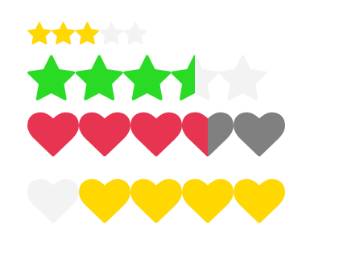

# Overview

Qodly Custom Component for Rating is a versatile and customizable React component designed to seamlessly integrate a user-friendly rating system into your Qodly applications. This component offers a range of features and properties to adapt to your specific needs, providing a visually appealing and interactive way for users to express their feedback.

## Key Features

- **Custom Icons:** Choose from a variety of icons to represent the rating elements. The default icon is a star, but you can easily customize it to match your application's theme. For example, you can use `heart` as the icon.

- **Accessibility Support:** The component includes an option to render an accessible element, enhancing usability for all users, including those with accessibility requirements. Set the `ReadOnly` prop to `true` to enable accessibility features.

- **Color Customization:** Tailor the appearance of the rating component by defining the colors of the empty and full elements. Use any valid CSS color values, such as hex codes or RGB values. For instance, you can set the `EmptyColor` to `#767B87` and the `FullColor` to `rgb(255, 215, 0)`.

- **Flexible Range Configuration:** Specify the minimum and maximum values for the rating system using the `Star` and `Stop` props. Additionally, control the number of elements to choose from or display at a time with the `Step` prop.

- **Orientation Control:** Determine the orientation of the rating items by setting the `Direct` prop to either `ltr` (left-to-right) or `rtl` (right-to-left).

- **Half-Fill Mode:** Opt for a half-filled shape or bounding box to represent fractional ratings by setting the `HalfFillMode` prop to `true`.

## Properties:

The Qodly Rating Component comes with a variety of properties to customize its appearance and behavior according to your application's requirements.

| Property         | Type      | Default              | Description                                                                     | Example                                        |
| ---------------- | --------- | -------------------- | ------------------------------------------------------------------------------- | ---------------------------------------------- |
| `Icon`           | `icon`    | `star`               | Specifies the icon used for each rating element.                                | `'heart'`                                      |
| `ReadOnly`       | `boolean` | `false`              | Determines whether to render an accessible element.                             | `true`                                         |
| `Empty Color`    | `string`  | `rgb(243, 243, 243)` | Sets the color of the empty rating elements.                                    | `'#767B87'`, `'rgb(203, 211, 227)'`, `'black'` |
| `Full Color`     | `string`  | `rgb(255, 215, 0)`   | Sets the color of the filled rating elements.                                   | `'#767B87'`, `'rgb(203, 211, 227)'`, `'black'` |
| `Star`           | `number`  | `0`                  | Defines the minimum value in the rating system.                                 | `2`                                            |
| `Stop`           | `number`  | `5`                  | Defines the maximum value in the rating system.                                 | `10`                                           |
| `Step`           | `number`  | `5`                  | Specifies the number of elements to choose from.                                | `5`                                            |
| `Direct`         | `string`  | `ltr`                | Sets the orientation of the rating items.                                       | `'ltr'`, `'rtl'`                               |
| `Half Fill Mode` | `boolean` | `false`              | Controls whether to half-fill the shape or bounding box for fractional ratings. | `true`                                         |
